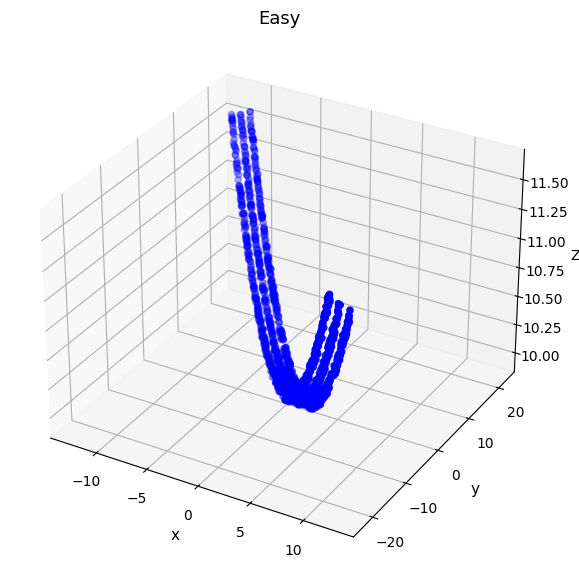
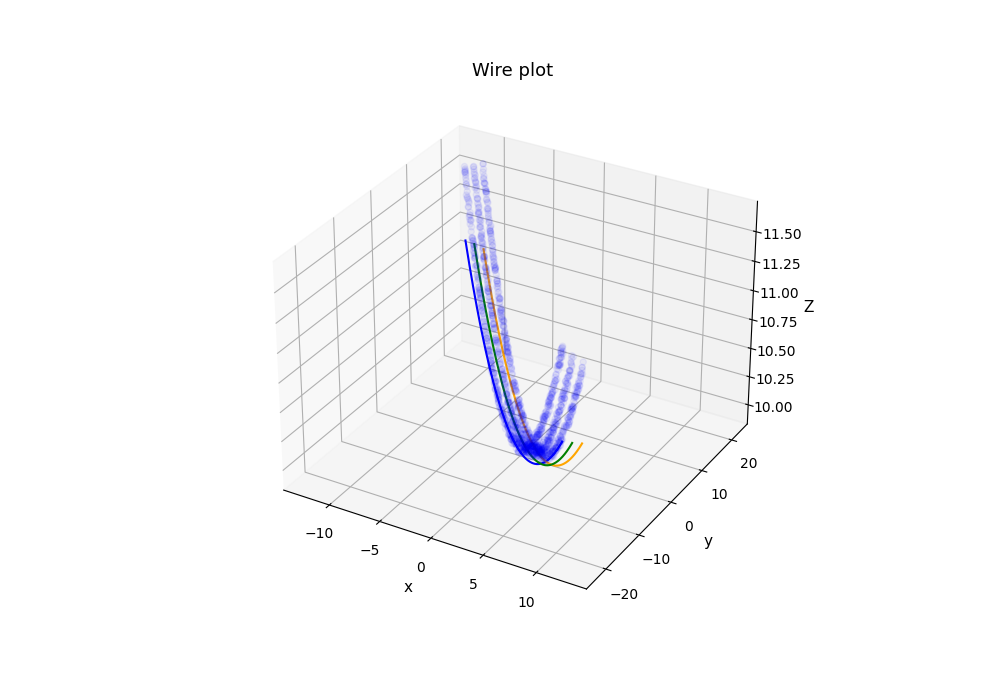
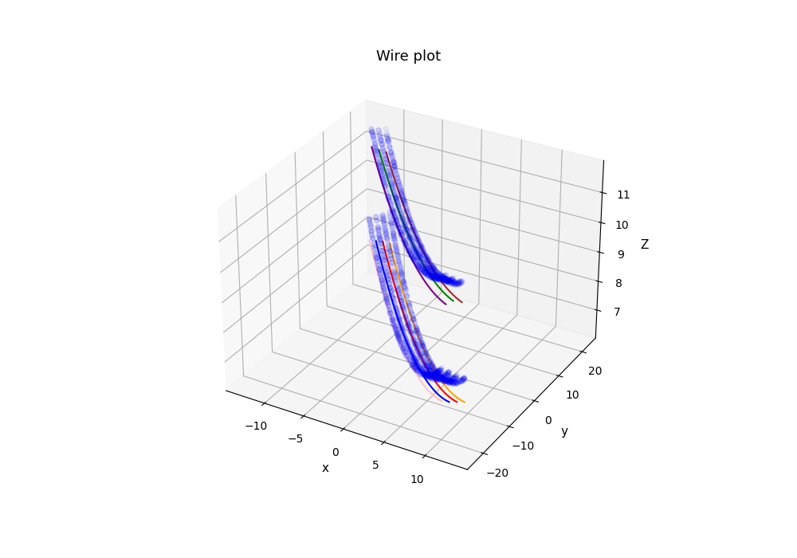
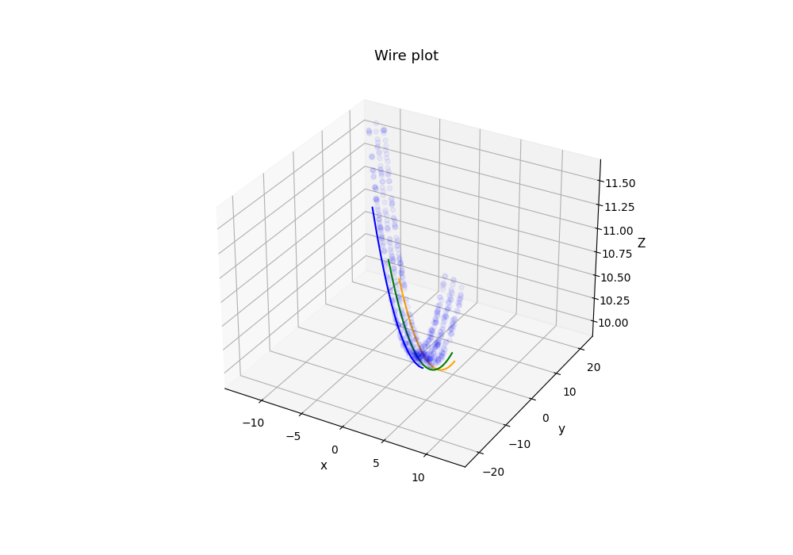

# LiDAR-case-study (Wire Detector)

## Context
In this scenario, we have been hired by an electricity network to help process Drone based LiDAR data of 
their electricity lines. Our task is to create a python package that can identify how many wires are present in 
a lidar point cloud and generate 3D catenary models of these wires.   

Example for data to our disposition:

   

## Methodology 

First, we have to find each wire. To do so, we will use clustering and an algorithm available on scikit-learn: DBSCAN (http://scikit-learn.org/stable/modules/generated/sklearn.cluster.DBSCAN.html). The point cloud datasets were pretty clean, I mean there wasn't really outliers points. So I didn't proceed to any transformation of the data. Not even normalization because it would have modified the scale only and the threshold value for the distance. The main parameter for DBSCAN model is eps, it is reffering to the minimal distance between point to be in the cluster. By trying values in a loop (around 15), eps = 0.65 seems to work well for the easy dataset. 

Second, I try to determine automatically the optimal eps value using silouhette score method and the k nearest neighbor one, but unfortunately, none of them really work well.

Third, I had to determine the plan (x, y) of the preious cluster to be able to apply the 2d catenary equation. To do so, I use the curve-fit function from scipy with the equation ax+b, to get the coeffictient a and b. Then, using a coefficient to determine the rotation angle of the data around, I was able to rotate the matrix. Now the wire was in the plan (x, z) and I will be able to find the catenary coefficient.

Then, before applying curve_fit with the catenary 2D equation, I group some clusters that seem to be in the same plan and remove too small ones.

Last, we use curve_fit and the 2D catenary equation to get those coefficent. To put the equation in a 3D space, we rotate x using the angle of before and we get:
$$ z = z_o + c * [cosh({x*cos(\theta) + y*sin(\theta) - x_o\over c}) - 1] $$
where $\theta = arctan(-a)$ and $y = a*x + b$

   

## How to use it 

The library contains a class Wire where to store the wire parameters. The module equation contains equation functions disccussed above. The rotation one contains a funtion to rotate a matrix. The helper one contains function to get cloud point labels using DBSCAN from scikit-learn. Finally, the file detector conatains a class Detector, by giving in entry the dataset and some optional parameters (eps or the scikit-learn model used), the class executes the entire process describe above. 

Then, the class will have severals attributes:
- labels: label of each point of the dataset
- plans: (a, b) values for each clusters
- catenaries: (zo, xo, c) for each clusters
- wires: a wire object for each clusters
- predictions: claculated points for each clusters
- scores: RMSE of y and z between the real values and the predictions

   

## Results

In order of appeaarence: Easy, Medium, Hard, and Extra Hard  

   
---
Ettore Hidoux: 2023/08/20
